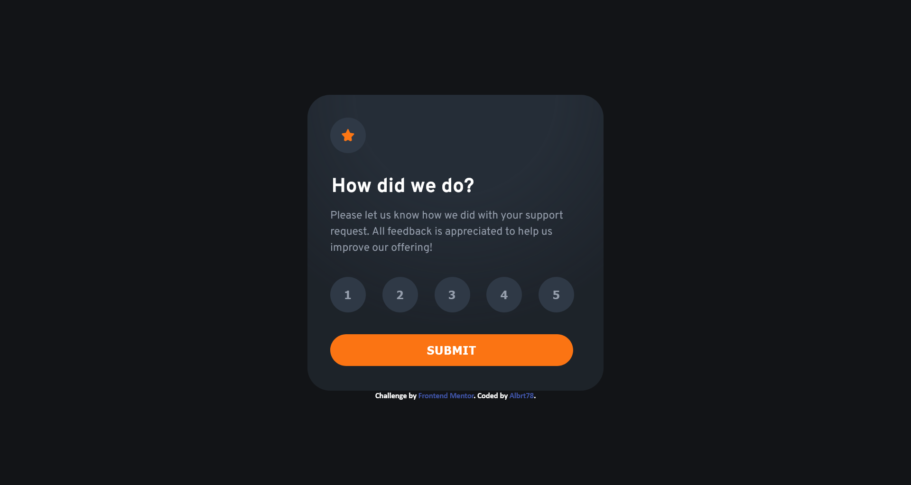

# Frontend Mentor - Interactive rating component

# Frontend Mentor - Interactive rating component solution

This is a solution to the [Interactive rating component challenge on Frontend Mentor](https://www.frontendmentor.io/challenges/interactive-rating-component-koxpeBUmI). Frontend Mentor challenges help you improve your coding skills by building realistic projects.

## Table of contents

-   [Overview](#overview)
-   [The challenge](#the-challenge)
-   [Screenshot](#screenshot)
-   [Links](#links)
-   [Built with](#built-with)
-   [Author](#author)

## Overview

Frontend Mentor is an online platform that provides challenges for web developers to improve their skills by building realistic projects. These challenges typically involve creating frontend designs based on provided designs or specifications.

### The challenge

Users should be able to:

-   View the optimal layout for the app depending on their device's screen size
-   See hover states for all interactive elements on the page
-   Select and submit a number rating
-   See the "Thank you" card state after submitting a rating

### Screenshot

### Links

-   Solution URL: [Interactive Rating Component](https://your-solution-url.com)
-   Live Site URL: [Interactive Rating Component](https://your-live-site-url.com)

## My process

### Built with

-   Semantic HTML5 markup
-   CSS custom properties
-   Flexbox
-   JavaScript

## Author

-   Frontend Mentor - [@Albrt78](https://www.frontendmentor.io/profile/Albrt78)
